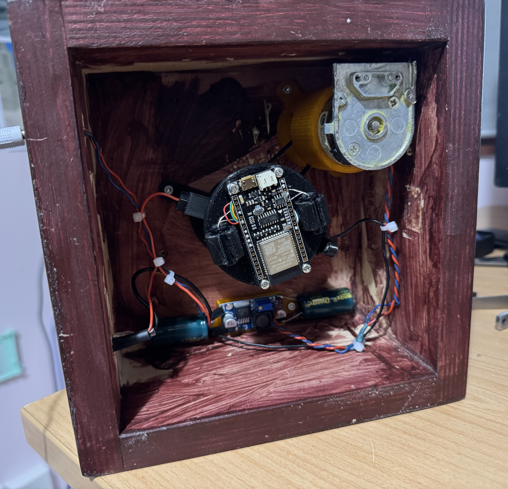
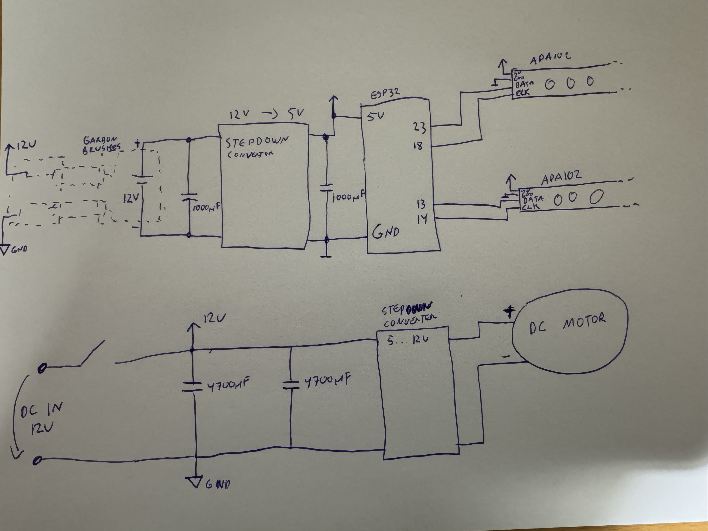

# ESP32 POV Display

This project implements a rotating Persistence of Vision (POV) display using an ESP32 microcontroller. The display creates images in the air by rapidly spinning and lighting up APA102 LED strips in sync with a hall sensor.

## 🔧 Hardware

- ESP32 DevKit v1
- 2x APA102 LED strips
- Hall sensor for rotation synchronization
- 3D-printed or custom-built rotating structure
- Power source 
- LittleFS for image storage or live UDP image streaming

## 📷 Build Photos

## 🎥 Demo Video

## ✨ Features

- Draws images mid-air using colorful LEDs
- Synchronizes to motor speed with a hall sensor
- Supports loading static images from flash memory (LittleFS)
- Also supports real-time image transfer via UDP
- Easy switching between images or animations
- Includes a simple Python sender script
